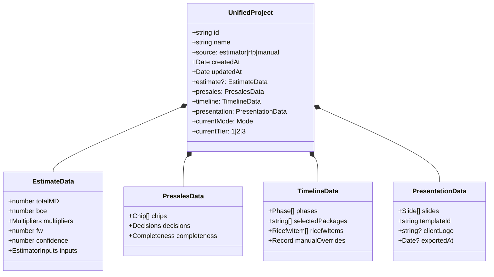
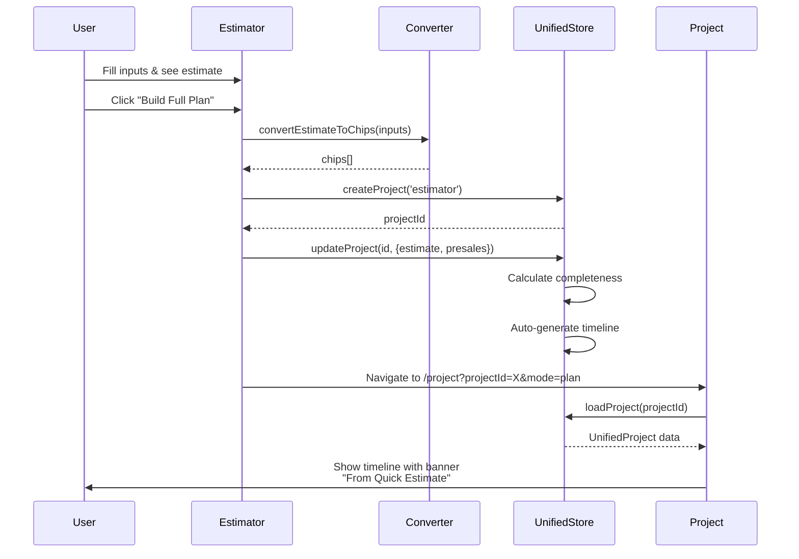
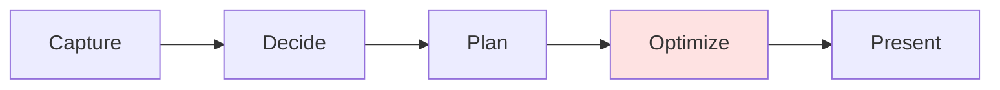
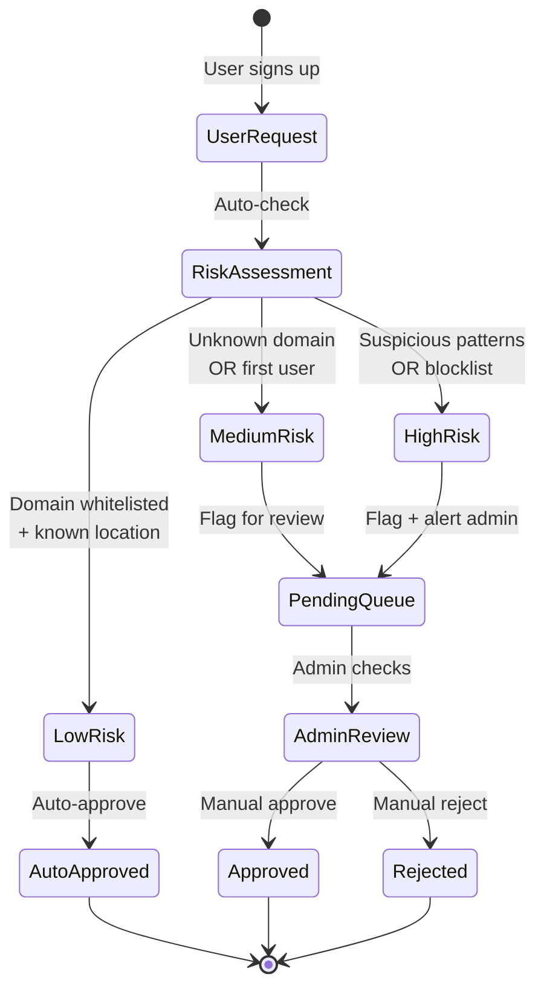
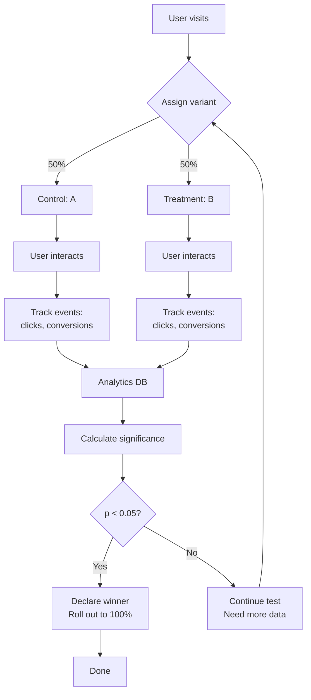
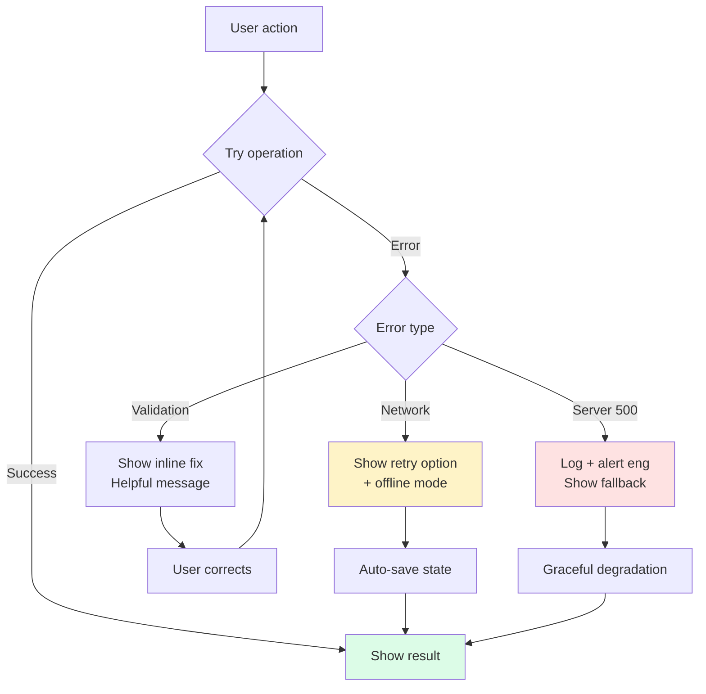

# Mermaid System Maps: Visual Architecture

**Source:** Holistic_Redesign_V2.md
**Date:** 2025-10-06

---

## 1. UNIFIED INFORMATION ARCHITECTURE

```mermaid
graph TD
    Landing[/ Landing Page<br/>Choose your path] --> QuickEst[Tier 1: Quick Estimator<br/>30 seconds]
    Landing --> FullPlan[Tier 2: Project Builder<br/>10 minutes]
    Landing --> Admin[Admin Dashboard]

    QuickEst --> EstResult[Estimate Results<br/>180 MD, 6 months]
    EstResult --> Bridge{Build Full Plan?}
    Bridge -->|Yes| Capture
    Bridge -->|No| Export1[Download PDF]

    FullPlan --> Capture[Capture Mode<br/>Extract from RFP]
    Capture --> Decide[Decide Mode<br/>5 decisions]
    Decide --> Plan[Plan Mode<br/>Timeline + Resources + RICEFW]
    Plan --> Present[Present Mode<br/>Client slides]
    Present --> Export2[Export PDF/PPTX]

    Export2 --> Loop{Edit more?}
    Loop -->|Yes| Plan
    Loop -->|No| Done[Done]

    style QuickEst fill:#dbeafe
    style Capture fill:#f3e8ff
    style Decide fill:#f3e8ff
    style Plan fill:#dcfce7
    style Present fill:#f3f4f6
    style Bridge fill:#fef3c7
```

---

## 2. UNIFIED STATE MODEL



---

## 3. ESTIMATOR → PROJECT HANDOFF FLOW



---

## 4. DATA FLOW: CHIPS → TIMELINE → SLIDES

```mermaid
flowchart LR
    RFP[RFP Text] --> Parser[Chip Parser]
    Parser --> Chips[Chips<br/>modules, scope,<br/>geo, etc]

    Estimator[Estimator Inputs] --> Converter[Chip Converter]
    Converter --> Chips

    Chips --> Bridge[presales-to-timeline-bridge]
    Bridge --> ClientProfile[Client Profile]
    Bridge --> Packages[SAP Packages]

    ClientProfile --> ScenarioGen[Scenario Generator]
    Packages --> ScenarioGen
    ScenarioGen --> BasePhases[Base Phases]

    BasePhases --> PhaseGen[Phase Generator]
    PhaseGen --> Timeline[Timeline<br/>phases, dates,<br/>resources]

    Timeline --> SlideGen[Slide Generator]
    SlideGen --> Slides[Presentation Slides]

    Slides --> Export[PDF/PPTX Export]

    style Chips fill:#dbeafe
    style Timeline fill:#dcfce7
    style Slides fill:#fef3c7
```



---

## 5. OPTIMIZE MODE MERGE (BEFORE → AFTER)

**BEFORE (5 Modes):**


**AFTER (4 Modes, Optimize merged into Plan):**
```mermaid
graph LR
    A[Capture] --> B[Decide]
    B --> C[Plan<br/><small>Tabs: Timeline | Resources | RICEFW</small>]
    C --> D[Present]

    style C fill:#dcfce7
```

---

## 6. ADMIN WORKFLOW: USER APPROVAL



---

## 7. A/B TEST FRAMEWORK



---

## 8. ERROR HANDLING & RECOVERY



---

**End of Mermaid System Maps**
